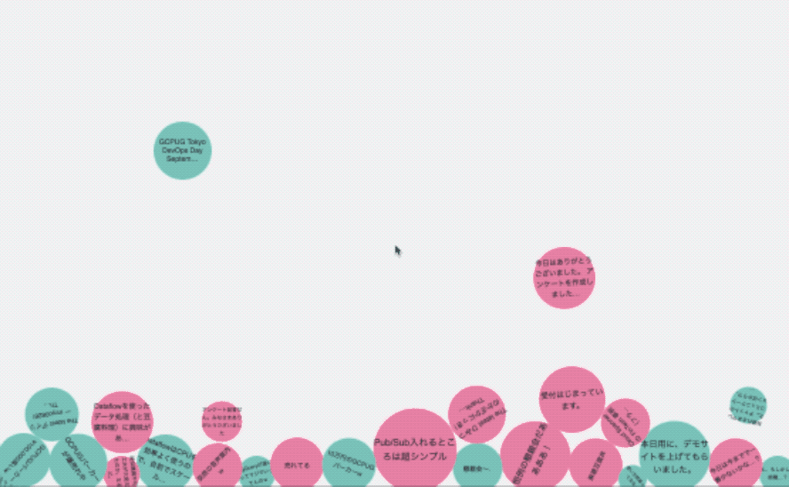

# nl-bubble

Cloud Natural Language API + Google App Engine + Firebase Demo WebApp.



### 1. Prerequisites

* If you don’t already have one, create a
    [Google Account](https://accounts.google.com/SignUp).

* Create a Developers Console project.
    1. Install (or check that you have previously installed)
        * [`git`](https://git-scm.com/downloads)
        * [Python 2.7](https://www.python.org/download/releases/2.7/)
        * [Python `pip`](https://pip.pypa.io/en/latest/installing.html)
        * [Google Cloud SDK](http://cloud.google.com/sdk/)
    3. [Enable Project Billing](https://support.google.com/cloud/answer/6293499#enable-billing)
    4. [Enable Natural Language API](https://console.cloud.google.com/apis/library/language.googleapis.com/)
    5. [Enable Big Query API](https://console.cloud.google.com/apis/library/bigquery-json.googleapis.com)        
    
### 2. Deploy to App Engine

1. Configure the `gcloud` command-line tool to use the project your Firebase project.
```
$ gcloud config set project <your-project-id>
```
2. Change directory to `nl-bubble-master/`
```
$ cd nl-bubble-master/
```
3. Install the Python dependencies
```
$ pip install -t lib -r requirements.txt
```
4. Create an App Engine App
```
$ gcloud app create
```
5. Deploy the application to App Engine.
```
$ gcloud app deploy app.yaml
```

### 3. Firebase project settings

1. [Import Google Project(Add Firebase to a Google Project)](https://console.firebase.google.com/?hl=en&pli=1)

2. Update and publish security rules.
```
{
  "rules": {
    ".read": "auth == null",
    ".write": "auth == null"
  }
}
```

### 4. You're Done!

Input your feelings.
```
https://<your-project-id>.appspot.com/
```

Access admin page to visualize the input feelings.
```
https://<your-project-id>.appspot.com/admin
```
